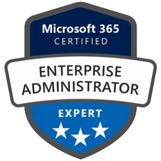
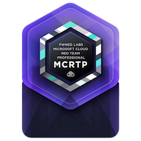
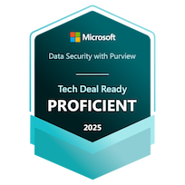

# About

Hi! I’m Sergio, a cybersecurity architect specializing in Microsoft security, identity, endpoint protection, cloud security, and data governance.

Through this blog, I share my experiences, research, hands-on labs, and lessons learned from working with Microsoft security technologies, including Microsoft Purview, Microsoft Defender, and Microsoft Entra.

Whether you’re a security professional, IT administrator, or simply curious about Microsoft’s security ecosystem, I hope you find something useful here.

 

# My certifications
## Microsoft Security certifications
### SC-100 Microsoft Certified: Cybersecurity Architect Expert

Validates expert-level skills in designing and implementing enterprise-wide cybersecurity strategies using Microsoft technologies across hybrid and multi-cloud environments.

[Verify SC-100 certification](https://learn.microsoft.com/api/credentials/share/en-us/shellgio/8740E50E06FD3D4C?sharingId=B8C6F33B11F93FCC)

## MS-102 Microsoft 365 Certified: Administrator Expert

Demonstrate the skills required to deploy, manage, and secure Microsoft 365 environments by implementing tenant administration, identity and access, device management, and compliance solutions.

[Verify MS-102 certification](https://learn.microsoft.com/api/credentials/share/en-us/shellgio/FD64ED592D8EC10?sharingId=B8C6F33B11F93FCC)

### SC-200 Microsoft Certified: Security Operations Analyst Associate

Investigate, search for, and mitigate threats using Microsoft Sentinel, Microsoft Defender for Cloud, and Microsoft 365 Defender.

[Verify SC-200 certification](https://learn.microsoft.com/api/credentials/share/en-us/shellgio/2E9B7005BEA31A6E?sharingId=B8C6F33B11F93FCC)

### SC-300 Microsoft Certified: Identity and Access Administrator Associate

Demonstrate the features of Microsoft Entra ID to modernize identity solutions, implement hybrid solutions, and implement identity governance.

[Verify SC-300 certification](https://learn.microsoft.com/api/credentials/share/en-us/shellgio/414506178C8D5D30?sharingId=B8C6F33B11F93FCC)

### SC-401 Microsoft Certified: Information Security Administrator Associate

As an Information Security Administrator, you plan and implement information security of sensitive data by using Microsoft Purview and related services.

[Verify SC-401 certification](https://learn.microsoft.com/api/credentials/share/en-us/shellgio/7748AE32FB7CA03B?sharingId=B8C6F33B11F93FCC)

## Other Certifications and badges
### eJPT - Junior Penetration Tester

[Verify eJPT certification](https://certs.ine.com/dd857260-da78-47c3-bd9f-d42b6270f895#acc.YBwe5AyU)

### MCRTP - Microsoft Cloud Red Team Professional

[Verify MCRTP certification](https://www.credly.com/badges/df428105-2df1-4c0e-8c36-cd7a54f29ef9/public_url)

### Data Security with Purview -​Proficient

[Verify badge](https://www.credly.com/badges/b74c2d1f-3aa9-453f-a7c0-f308569bd3b6/public_url)

### AZ-900 Microsoft Certified: Azure Fundamentals
[Verify AZ-900 certification](https://learn.microsoft.com/api/credentials/share/en-us/shellgio/821BEB902A913EFA?sharingId=B8C6F33B11F93FCC)
### AZ-104 Microsoft Certified: Azure Administrator Associate
[Verify AZ-104 certification](https://learn.microsoft.com/api/credentials/share/en-us/shellgio/9FADF612B3177267?sharingId=B8C6F33B11F93FCC)
### MS-700 Microsoft 365 Certified: Teams Administrator Associate
[Verify MS-700 certification](https://learn.microsoft.com/api/credentials/share/en-us/shellgio/4B7A5EC890A6E2E3?sharingId=B8C6F33B11F93FCC)
